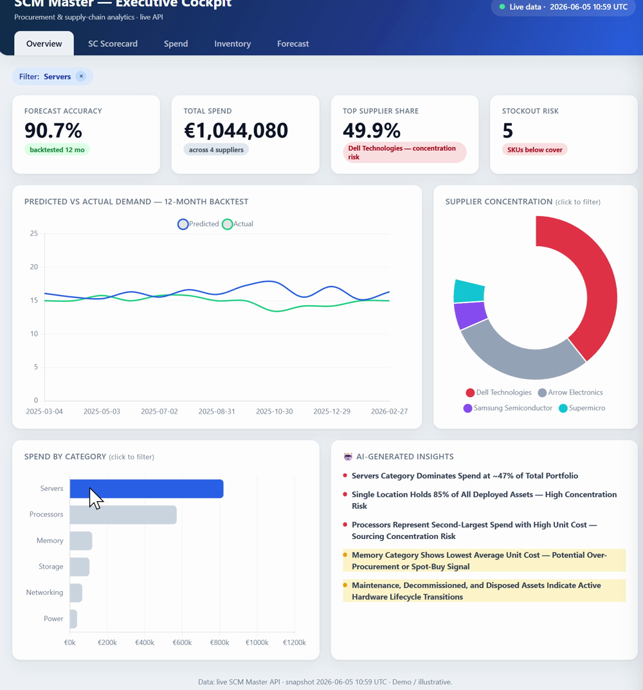
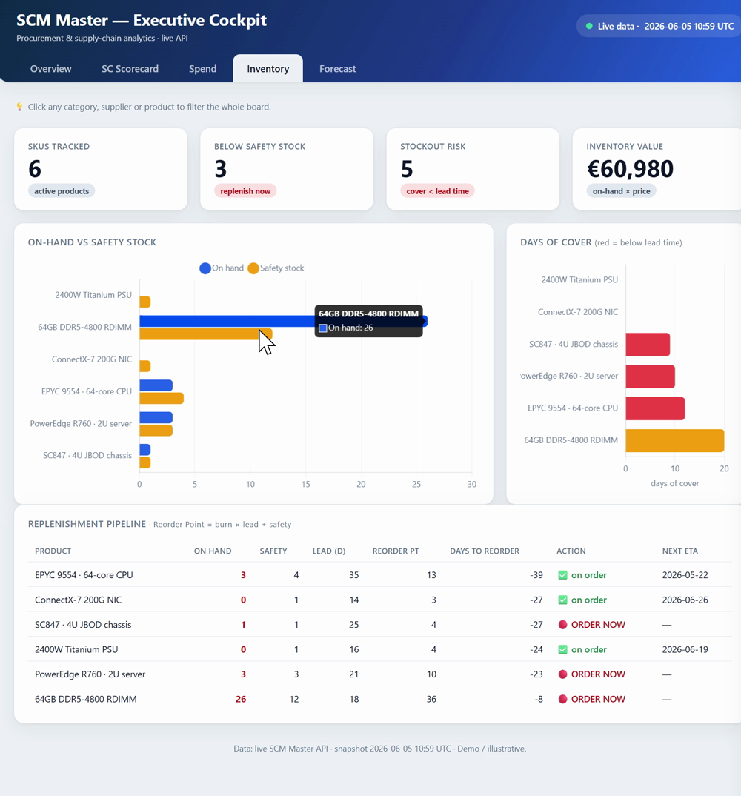

# Dashboard Documentation

Documentation for the SCM Master evidence dashboard. There are **two synchronized front-ends** on
the same live API: the **Power BI report** (`../Order_Accuracy_Forecast_2026.pbix`, the lab
deliverable) and the **live web cockpit** ([hosted](https://scm-power-bi-production.up.railway.app)).
This file covers metrics, design rationale, and how to use them.

---

## 1. Use case

Help **Cleo (CEO)** decide whether to invest in **AI demand forecasting** for procurement at a
cloud/hosting enterprise (~5,000 staff). The dashboard is the **evidence layer**: it shows whether
the AI forecast is trustworthy, where it fails, and what action falls out of it — so the invest /
wait / pilot decision rests on data, not vendor claims.

## 2. Key metrics — what each means & why it matters to the decision

| # | Metric | Definition | Why Cleo cares |
|---|---|---|---|
| 1 | **Forecast Accuracy** | `1 − WMAPE` over 12-month backtest | The headline trust number — is the AI right enough to act on? |
| 2 | **MAPE / WMAPE** | mean & volume-weighted abs % error | Separates "right on small items" from "right on what matters" |
| 3 | **Forecast Bias** | `Σpredicted / Σactual` | Tells *direction* of error (over/under-forecasting) → fixable |
| 4 | **Accuracy by category** | WMAPE per category | Shows where AI works (Storage 8.5%) vs fails (Networking ~21%) → where to pilot |
| 5 | **Total Spend** | Σ purchase spend | Scale of the operation the decision affects (~€640m) |
| 6 | **Top Supplier Share / HHI** | concentration of spend | Single-source risk — ties to chip geopolitics `[E1]` |
| 7 | **Stockout Risk** | SKUs with cover < lead time | The cost of a wrong forecast, in plain terms |
| 8 | **Reorder Point & Days-to-reorder** | `burn×lead+safety`; days until hit | Converts the forecast into *when to act* |

> 5–8 of these are surfaced as the headline cards; the rest live one click deeper. This keeps the
> top level to the **communication layer** (decision metrics) and pushes detail to the analysis layer.

## 3. Pages / tabs

| Tab | Purpose |
|---|---|
| **Overview** | The 4 decision cards + predicted-vs-actual line (the "money shot") + supplier/spend mix + AI insights |
| **SC Scorecard** | Full supply-chain KPI panel; every tile is click-to-drill to its formula + rows |
| **Spend** | Spend by category/supplier/product; cross-filters the board |
| **Inventory** | On-hand vs safety, days-of-cover, and the **reorder pipeline** with ORDER NOW actions |
| **Forecast** | MAPE/WMAPE, accuracy by category, error trend, and the **why-it-missed / how-to-fix** drill-down |

## 4. Design rationale (communication-layer principles)

- **One screen answers the CEO question first.** The four cards (accuracy, spend, concentration,
  stockout risk) are the decision; everything else is supporting evidence behind a click.
- **Chart choices match the question:** line for predicted-vs-actual (trend over time), donut for
  supplier concentration (part-to-whole), bars for category comparison, tables for actionable lists.
- **Explainability over flash:** every KPI drills to its formula and underlying rows — built to
  survive "where does that number come from?" (the antidote to AI hype `[B1]`).
- **Colour = action, not decoration:** 🔴/🟡/🟢 only where it signals do-something (ORDER NOW,
  worst category), not as theming.
- **Single source of truth:** both front-ends read the same live API, so Power BI and the web
  cockpit can never disagree.

## 5. Data source
- **Operational data:** synthetic, served by the live SCM Master API (login → Bearer → analytics
  endpoints). Reproducible; documented in [`../research/01_data_assumptions.md`](../research/01_data_assumptions.md).
- **Market-evidence data:** public, compiled from cited sources into
  [`../data/processed/ai_adoption_evidence.csv`](../data/processed/ai_adoption_evidence.csv)
  (see [`../sources.md`](../sources.md)).

## 6. How to use the dashboard
- **Power BI:** open `../Order_Accuracy_Forecast_2026.pbix` in Power BI Desktop → Refresh (it
  auto-logs into the API per [`live_api_connection.md`](live_api_connection.md)).
- **Web cockpit:** visit **https://scm-power-bi-production.up.railway.app** — it auto-refreshes.
  Click any category/supplier to filter the whole board; click any KPI tile to drill into its
  formula and rows; click a forecast category for the why/how diagnostic.

## 7. Screenshots

**Overview — the four decision cards + predicted-vs-actual + supplier mix + AI insights**

**Inventory — the reorder pipeline (reorder point, days-to-reorder, ORDER NOW actions)**

*(Citations `[n]` resolve in [`../sources.md`](../sources.md).)*
